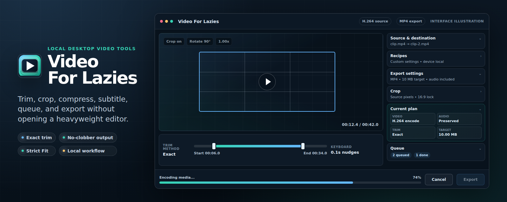

<p align="center">
  
</p>

# Video For Lazies

Video For Lazies is a small desktop app for the video jobs that should not require a full editor: trim the useful part, crop the frame, resize it, set a target size if needed, and export through FFmpeg.

It is built with Tauri, React, Rust, and FFmpeg. The goal is a practical local tool: drag in a file, choose the output shape, and get a predictable export without opening a heavyweight timeline.

<p align="center">
  <a href="https://github.com/Setmaster/Video_For_Lazies/releases" aria-label="Download the latest Video For Lazies release">
    
  </a>
</p>

## Highlights

- Trim clips with direct in/out handles, keyboard nudges, and a live preview.
- Crop by drawing over the preview, optionally with aspect lock or auto-detect crop.
- Resize by max edge, rotate, reverse, change playback speed, and adjust brightness, contrast, and saturation.
- Export to `mp4`, `webm`, or `mp3`.
- Target a file size in decimal MB, or disable size targeting for constant-quality export.
- Keep audio on/off, title metadata, recent export status, and output format in the app workflow.
- Auto-suggest safe output names in the same folder and avoid overwriting existing `-N` exports.
- Save a preview frame as PNG.

## Who It Is For

Use Video For Lazies when you need a focused export pass instead of a full editing session. It is meant for quick clips, smaller uploads, screen recordings, simple crops, speed changes, and "make this fit under a size limit" jobs.

It is not trying to replace a nonlinear editor. There are no multi-track timelines, effects stacks, or media bins.

## Download

Download the current prerelease from [GitHub Releases](https://github.com/Setmaster/Video_For_Lazies/releases).

- Windows x64: `Video_For_Lazies-v0.1.0-win-x64.zip`
- Linux x64: `Video_For_Lazies-v0.1.0-linux-x64.zip`
- Checksums: `SHA256SUMS.txt`

The portable builds bundle pinned FFmpeg sidecars, including `ffprobe`, so end users do not need to install FFmpeg separately for supported Windows and Linux releases.

Windows builds are unsigned, so Windows may show SmartScreen or antivirus reputation warnings until the project has signing and reputation history. Verify the checksum before running downloaded binaries.

## From Source

Requirements:

- Node.js
- Rust toolchain
- FFmpeg and FFprobe on `PATH`, or set `VFL_FFMPEG_PATH` and `VFL_FFPROBE_PATH`

Run the app:

```bash
cd app
npm install
npm run tauri dev
```

Build the app:

```bash
cd app
npm run tauri build
```

## Portable Builds

```bash
cd app
npm run portable
```

This writes a portable folder at:

```text
release/Video_For_Lazies/
```

The folder contains the app executable, bundled `ffmpeg-sidecar/`, and required project/legal files. Windows portable folders also run a packaged-app startup smoke check. Linux portable folders verify the bundled FFmpeg and FFprobe with an encode/probe smoke.

To produce a verified release archive:

```bash
cd app
npm run release:portable
```

That command builds the portable folder, creates a versioned x64 zip such as `release/Video_For_Lazies-v0.1.0-win-x64.zip` or `release/Video_For_Lazies-v0.1.0-linux-x64.zip`, writes `release/SHA256SUMS.txt`, and verifies the extracted archive.

Release process details are in [`docs/release.md`](docs/release.md).

## Usage Notes

- Size targets use decimal MB: `1 MB = 1,000,000 bytes`.
- Set size limit to `0`, or leave it empty, to disable size targeting.
- Bundled MP4 export uses H.264 when the staged FFmpeg sidecar exposes `libx264`.
- If the active FFmpeg build does not expose `libx264`, MP4 export falls back to `mpeg4`.
- Process media files you trust. Video For Lazies runs FFmpeg locally as your user, so hostile media exercises the active FFmpeg build.

## Tests

```bash
cd app
npm test
npx tsc --noEmit
npm run build
cargo test --manifest-path src-tauri/Cargo.toml
```

## FFmpeg And Licensing

Video For Lazies is licensed under GPL-3.0-or-later. See [`LICENSE`](LICENSE).

Windows x64 and Linux x64 portable builds bundle pinned GPL FFmpeg runtimes as sidecars. Runtime resolution order is:

1. `VFL_FFMPEG_PATH` / `VFL_FFPROBE_PATH`
2. bundled `ffmpeg-sidecar/` next to the app executable
3. plain `ffmpeg` / `ffprobe` on `PATH`

Bundle provenance, exact URLs, checksums, and corresponding source information are documented in [`docs/ffmpeg-bundling.md`](docs/ffmpeg-bundling.md). Third-party notices are in [`THIRD_PARTY_NOTICES.md`](THIRD_PARTY_NOTICES.md), and source availability notes are in [`SOURCE.md`](SOURCE.md). Portable builds copy generated release-specific versions of those notice files into each zip.

## Security

Please report security issues privately. See [`SECURITY.md`](SECURITY.md).
